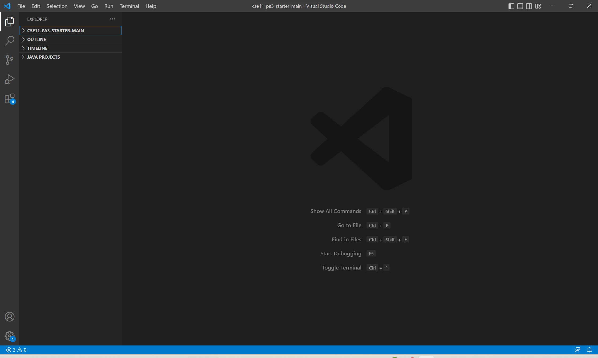
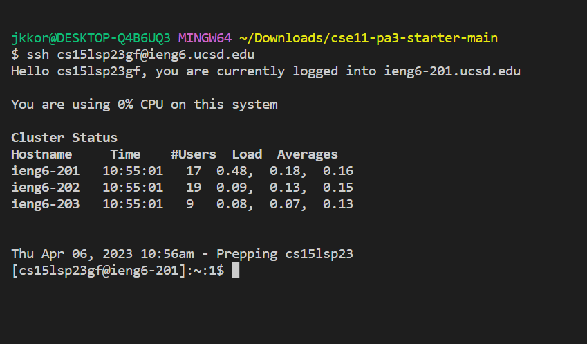
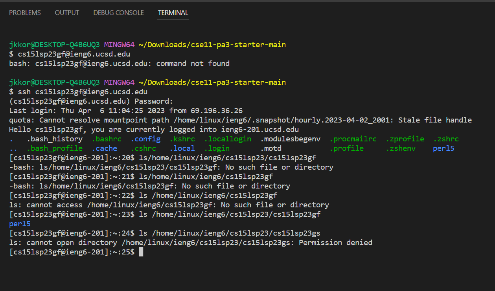

# Lab report 1: How to log into a course-specific account on ieng6
---
**Step 1: Account Set Up**

First click [here](https://sdacs.ucsd.edu/~icc/index.php), then follow this [tutorial](https://drive.google.com/file/d/17IDZn8Qq7Q0RkYMxdiIR0o6HJ3B5YqSW/view) to set up your password: 

**Step 2: Downloading VS Code**

In order to do the lab, we will need to download VS Code. To do this click [this](https://code.visualstudio.com/) and follow the steps depending on the OS of your device. The final product once you open VS code should look like this: 

**Step 3: Remote connections**

To start remote connections you will need to complete the following steps in order:

1. Download git at this link: https://gitforwindows.org/ and follow all steps on the website for installation. 
2. Then follow this link to set up Bash in VS code: https://stackoverflow.com/questions/42606837/how-do-i-use-bash-on-windows-from-the-visual-studio-code-integrated-terminal/50527994#50527994
3. Next, open VS code and open the terminal by clicking the terminal button on the top and then clicking the new terminal menu option.
4. In the terminal, type the command `$ ssh cs15lsp23zz@ieng6.ucsd.edu` (type everything after the $) and replace the "zz" with the last two letters of your username, which you found during the tutorial in step 1. 
5. After typing the code in and hitting enter you should see the message 

`⤇ ssh cs15lsp23zz@ieng6.ucsd.edu
The authenticity of host 'ieng6.ucsd.edu (128.54.70.227)' can't be established.
RSA key fingerprint is SHA256:ksruYwhnYH+sySHnHAtLUHngrPEyZTDl/1x99wUQcec.
Are you sure you want to continue connecting (yes/no/[fingerprint])?`

Type yes, and you should see the message 
 
`ssh cs15lsp23zz@ieng6.ucsd.edu
The authenticity of host 'ieng6-202.ucsd.edu (128.54.70.227)' can't be established.
RSA key fingerprint is SHA256:ksruYwhnYH+sySHnHAtLUHngrPEyZTDl/1x99wUQcec.
Are you sure you want to continue connecting (yes/no/[fingerprint])? 
Password:`

Enter the password that you set in step one. If nothing is showing up while you are typing your password, do not worry. The characters are just invisible so just proceed with inputting your password as you normally would and hit enter. You should now have a message like this:

`Last login: Sun Jan  2 14:03:05 2022 from 107-217-10-235.lightspeed.sndgca.sbcglobal.net
quota: No filesystem specified.
Hello cs15lsp23zz, you are currently logged into ieng6-203.ucsd.edu`

`You are using 0% CPU on this system`

`Cluster Status
Hostname     Time    #Users  Load  Averages  
ieng6-201   23:25:01   0  0.08,  0.17,  0.11
ieng6-202   23:25:01   1  0.09,  0.15,  0.11
ieng6-203   23:25:01   1  0.08,  0.15,  0.11`

`Sun Jan 02, 2022 11:28pm - Prepping Cs15lsp23`

Now your computer, which we call the "client", is connected to a computer in the basement, which we call the "server", depending on the connection. It should look similiar to this:

**Step 4: Running Various Commands**

There are a number of commands we can use such as `cd, ls, pwd, mkdir`, and `cp`. Try these specific commands and view their respective outputs:

* `cd ~` - navigates you to your home directory 
* `cd` - displays the current directory
* `ls -lat`- shows the files and directories in the current working directory sorted by modification time, with recently modified files or directories listed first
* `ls -a`- shows all files and directories in the current working directory, including hidden files and directories
* `ls /home/linux/ieng6/cs15lsp23/cs15lsp23abc` replacing `abc` with another person's cse15 username.-  shows the contents of /home/linux/ieng6/cs15lsp23/cs15lsp23abc directory listed in the terminal. If the directory does not exist or you do not have the necessary permissions to access it, you will see an error message
* `cp /home/linux/ieng6/cs15lsp23/public/hello.txt ~/`-copies the file hello.txt from the directory /home/linux/ieng6/cs15lsp23/public to your home directory and overwrites any files with the same file name that already exists in your home directory 
* `cat /home/linux/ieng6/cs15lsp23/public/hello.txt`- displays the contents of the file hello.txt, located in the directory /home/linux/ieng6/cs15lsp23/public

The output should look like this:

This picture is showing that you have accessed and are running commands on the remote server. 
